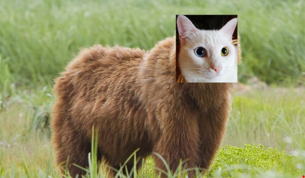

# NWMSU-Wellness
## Application Name: Mindful Bearcats

Mindful Bearcats shows the students of NWMSU ways to help deal with problems related to mental well-being. The app features a list of events that users can attend locally to help keep them active and about, a meditation section to help them relax their mind, and a scheduler section to promote proper time management.  The landing page features daily quotes or suggestions for users to improve their overall health and mental acuity.

## Application Activities
* Home Page
* Local Events / Activities Page
* Mental Health Page
* Scheduler
* Meditation Tab

## Contributors:
1. Reason Adhikari
2. Alexander Dieringer
3. Daniel Omole

### Application Requirements:
* Minimum SDk: 26
* Preferred emulator/device: Pixel XL API 30

### Application Logo

